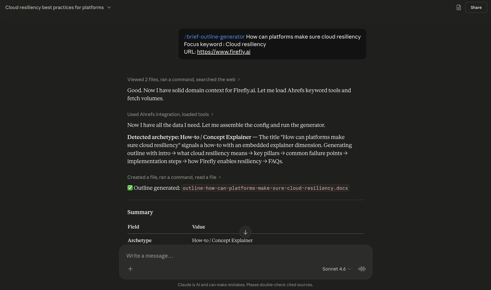

# Brief Outline Generator

A Claude skill that turns a blog title and a focus keyword into a structured, formatted Word document, a **content outline** a writer can fill in.

<p align="center">
  
</p>

Built for SEO and content teams who want consistent outlines without writing them by hand. The output is a skeleton, not a finished article: section headings, short topic prompts, FAQ questions, with formatting that's ready to hand to a writer.

---

## Table of contents

- [What this skill does](#what-this-skill-does)
- [Quick start](#quick-start)
- [How it works](#how-it-works)
- [Output format](#output-format)
- [Repository layout](#repository-layout)

---

## What this skill does

You provide a title, a focus keyword and domain url and it gives a .docx file with the brief-outline as the output. It contains:

- **Metadata table**: title, URL slug, word count, target intent, target audience
- **Keyword volume block**: focus keyword and secondary keywords with their US monthly search volumes pulled from Ahrefs
- **Full content outline**: section headings, short topic prompts under each section, an FAQ section at the end

---

## Quick Start

Drop a docs URL in any message:

```
Generate an outline for "How Do Platform Teams Implement Cloud Disaster Recovery"
Create a brief for this title: ...
I need a content outline for the keyword "observability for platform teams"
/brief-outline-generator how to build claude skills
```

Claude will ask for any missing required inputs.

### Inputs the skill needs

| Field | Required | Notes |
|---|---|---|
| Title | ✅ | Blog post title |
| Focus keyword | ✅ | Primary keyword |
| Domain URL | ✅ | Used to fetch product/context info |
| Word count range | ✅ | e.g., `1500-2000` |
| Target intent | ✅ | `Informational`, `Commercial`, `Transactional`, or `Navigational` |
| Target product | ⬜ | Optional. If set, adds a "How [Product] Helps with X" section |
| Secondary keywords | ⬜ | Optional. If omitted, the skill generates five |

<p align="center">
  
</p>

### What you get back

A `.docx` file named `outline-{slug}.docx`, saved to your downloads folder (or `/mnt/user-data/outputs/` when running in a sandboxed Claude environment).

### Things to know

**Volume mismatch flag.** If your focus keyword has 10× less monthly search volume than any of your secondary keywords, the skill flags it before generating and asks whether you want to swap. You decide; it never auto-swaps.

**Domain fetch can fail.** Some sites (Cloudflare, bot-blockers) return 403 to the domain analyzer. The skill continues; it just skips product-specific context. The outline still generates correctly.

**Ahrefs is optional.** If the Ahrefs connector isn't installed in your Claude session, all volumes show as `N/A` and the skill warns you once. Everything else works.

---

## How it works

A run consists of 8 steps.

### Step 1: Validate inputs

The skill checks that all required fields are present and well-formed: title is non-empty (and warns if it exceeds 70 characters), domain URL starts with `http://` or `https://`, word count range is two positive integers separated by a hyphen, target intent matches one of the four allowed values. Validation errors halt the run before any work is done.

### Step 2: Read the rules

Claude reads `references/section-rules.md` in full. This file is the single source of truth for what an outline should look like.

### Step 3: Run domain analysis

The script `scripts/domain-analyzer.py` fetches the homepage and sitemap of the supplied domain, extracts the most frequent meaningful terms, and returns a JSON blob containing `domain_context`, `key_terms`, and `focus_area`. This output informs upstream decisions such as what to name the product section, what vocabulary to favor, etc.

### Step 4: Fetch keyword volumes

Claude calls `tool_search` to load the Ahrefs MCP tools, then calls `Ahrefs:keywords-explorer-volume-by-country` once per keyword (focus + each secondary) to get US monthly search volumes.

If a single keyword call fails, that keyword's volume becomes `"N/A"` and the run continues. If the Ahrefs connector isn't available at all, every volume is `"N/A"` and the user is told.

The skill also runs a **volume mismatch check** here: if the focus keyword's volume is more than 10× smaller than any secondary keyword's volume, the user is asked whether to swap before generating.

### Step 5: Build the outline

Claude assembles a JSON config using the archetype's section set. Each section is a `{heading, title, rules, subsections}` object.

### Step 6: Run the final quality check

If any check fails, the outline is revised and re-checked. Only after all twelve pass does generation proceed.

### Step 7: Run the renderer

`scripts/generate-brief.py` consumes the config and renders the `.docx` file. The script handles layout, fonts, colors, table cells, OOXML schema correctness, and ensures the output directory exists before writing.

### Step 8: Present the file

Claude returns the file path along with a one-line summary: slug, audience, focus keyword and its volume, secondary keywords with their volumes, total section count.

---

## Output format

The rendered `.docx` contains:

**Metadata + keyword volume table.** Three columns: `Field | Value | USA Search Volume`. Standard metadata rows (Title, URL Slug, Word Count, Target Intent, Target Audience) span columns 2 and 3. A banner row separates the metadata from the keyword block, a sub-header row (`Type | Keyword | USA Search Volume ↓`). The focus keyword and each secondary keyword get their own row with the volume in column 3.

**H1 title.** The full blog post title.

**Sections.** Each section heading is prefixed with a grey `[H2]` or `[H3]` label so the writer can never misread the level. Bullets under each section are formatted as short prompts. Subsections are indented and styled consistently.

The full output stays under a single document — no separate appendices, no embedded images.

---

## Config schema reference

The JSON Claude assembles before calling the renderer.

```json
{
  "title": "How to Build Claude Skills",
  "focus_keyword": "building claude skills",
  "focus_keyword_volume": "30",
  "domain_url": "https://example.com/",
  "word_count_range": "1500-2000",
  "target_intent": "Informational",
  "target_product": "OptionalProductName",
  "archetype": "how_to",
  "secondary_keywords": [
    { "keyword": "Claude Code Skills", "volume": "3,400" }
  ],
  "output_path": "/path/to/outline.docx",
  "outline": [
    {
      "heading": "H2",
      "title": "Section Title",
      "rules": ["short topic prompt", "another prompt"],
      "subsections": [
        {
          "heading": "H3",
          "title": "Subsection Title",
          "rules": ["..."],
          "subsections": []
        }
      ]
    },
    {
      "heading": "H2",
      "title": "FAQs",
      "rules": [
        "How do I install a Claude skill?",
        "How is a Claude skill different from a regular prompt?"
      ]
    }
  ]
}
```

### Field details

- `title` — required. Warns if > 70 characters.
- `focus_keyword` — required. The primary SEO target.
- `focus_keyword_volume` — string. Either thousands-formatted digits (`"3,400"`), plain digits for sub-1000 (`"500"`), `"0"` for zero volume, or `"N/A"` if the fetch failed.
- `domain_url` — required. Must start with `http://` or `https://`.
- `word_count_range` — required. Two integers joined by a hyphen.
- `target_intent` — required. One of the four standard values.
- `target_product` — optional. If present, the outline includes a "How [Product] Helps with X" section.
- `archetype` — optional but recommended. One of `listicle`, `comparison`, `how_to`, `concept`. The skill classifies this automatically.
- `secondary_keywords` — list of `{keyword, volume}` objects. If empty, the skill generates five.
- `output_path` — optional. Defaults to `/mnt/user-data/outputs/outline-{slug}.docx`.
- `outline` — required. The actual section tree (described above).

---

## Repository layout

```
brief-outline-generator/
├── SKILL.md                  # Skill metadata + workflow Claude follows
├── README.md                 # This file
├── references/
│   └── section-rules.md      # Outline rules, archetypes, per-section rules, examples
├── scripts/
│   ├── generate-brief.py     # DOCX renderer
│   └── domain-analyzer.py    # Domain fetcher and term extractor
└── examples/
    └── *.docx                # Seven good outlines for reference only
```
---
